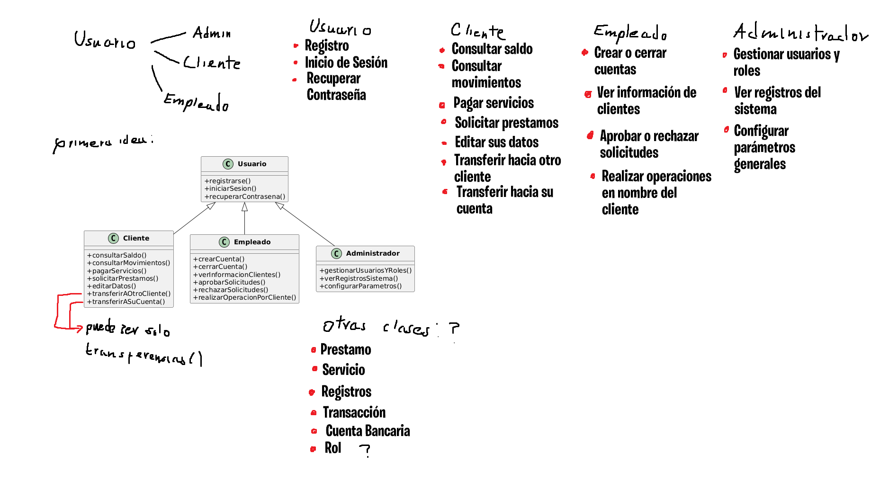
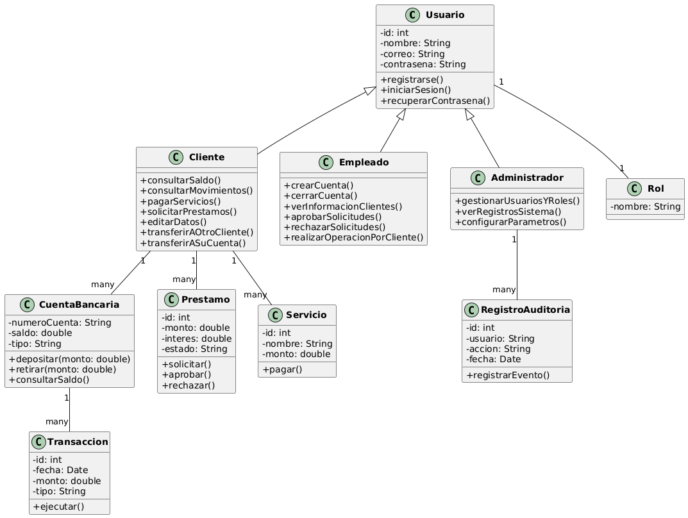
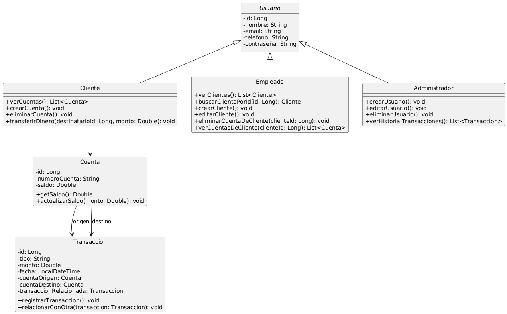

# BankApp
**BankApp** is a web application developed using **Spring Boot** for the backend and **HTML, CSS, and JavaScript** for the frontend.
The app simulates a banking platform where different types of users; **clients**, **employees**, and **administrators**, interact with the system based on their roles and permissions.

The project includes features such as user management, transactions, bank account operations, and access control using **JWT (JSON Web Tokens)**. It is structured using clean architecture principles, REST APIs, security best practices, and JPA inheritance, providing a friendly and functional interface for each user type.

Here are some of my first rough drafts of how I wanted to structure the project:



My first thoughts on the structure of the project.



This diagram was based on the first idea draft that I had, so not all the functions where implemented in the project.



The final diagram and the one that I was based on to make the full project.

---

##  Technologies Used

### Backend
- Java 17
- Spring Boot
- Spring Security + JWT
- JPA (Hibernate)
- MySQL
- Lombok
- Maven

### Frontend
- HTML5
- CSS3
- Vanilla JavaScript

---

##  Role-Based Functionality

###  Administrator
- Create, edit, and delete **any user** (clients, employees, admins).
- View the **full transaction history**.
- Has **full system control**.

###  Employee
- View, search, and edit clients.
- Create new clients.
- Delete specific client accounts.

###  Client
- View their accounts and balances.
- Create and delete their own accounts.
- Make transfers to other clients.

---

##  Main Features

### 1. Login with JWT
- On login, users receive a **JWT token** stored in `localStorage`.
- All backend requests include this token in the `Authorization` header.
- Backend endpoints are secured by **user role**.

### 2. User Management (Admin)
- View all users.
- Edit user data (name, email, phone).
- Create users of any type.
- Delete users (while preserving referential integrity).
- Frontend: `usuarios.html`
- JS Logic: `usuarios.js`

### 3. Client Management (Employee)
- Page: `clientes.html`
- View a table of all users with the role **CLIENT**.
- Create new clients via a form.
- Search clients by ID.
- Edit client information.
- View all client accounts and their total balance.
- Delete individual client accounts.
- Logic in `clientes1.js` using `/api/usuarios/clientes`.

### 4. Client-to-Client Transfers
- Page: `transferencia.html`
- Clients select their **source account** and enter the **destination client ID**.
- Backend validates and processes the transfer.
- Transfers generate **two related transactions** (debit & credit).

### 5. Transaction History (Admin)
- Page: `registros.html`
- Displays all transactions with:
  - Source and destination accounts
  - Amount, date, and type
- Allows viewing of **transaction relationships** (e.g., linked transfers).

### 6. Entity Relationships
- Main entities:
  - `Usuario` (base class for `Cliente`, `Empleado`, `Administrador`)
  - `Cuenta`
  - `Transaccion`
- Uses:
  - `@Inheritance(strategy = SINGLE_TABLE)` for user roles
  - `@ManyToOne` between `Cuenta` and `Cliente`
  - Optional `@ManyToOne` from `Transaccion` to another `Transaccion` (for related transfers)

### 7. Security & Integrity
- All actions protected by **role-based access** via Spring Security.
- Deletion of users/accounts is **restricted if dependent data exists** (e.g., a user with transactions cannot be deleted directly).

---

##  Project Structure

```
src/
├── main/
│   ├── java/com/s8mil/bank_webapp/
│   │   ├── controller/         # REST controllers
│   │   ├── entity/             # JPA entities (Usuario, Cliente, Cuenta, etc.)
│   │   ├── repository/         # JPA repositories
│   │   ├── service/            # Service interfaces
│   │   ├── service/impl/       # Service implementations
│   │   └── security/           # JWT config and filters
│   └── resources/
│       ├── application.properties   # DB and port configuration
│       └── static/                  # Static files (HTML, CSS, JS)
```

---

##  Requirements

1. Java 17 or higher
2. MySQL with a database named `banking_app`
3. Configure `application.properties`:
   ```properties
   spring.datasource.url=jdbc:mysql://localhost:3306/banking_app
   spring.datasource.username=root
   spring.datasource.password=your_password
   spring.jpa.hibernate.ddl-auto=update
   spring.jpa.show-sql=true
   jwt.secret=superSecureSecret123 (or whichever key you would like to use)
   ```

4. Run the application:
   ```bash
   ./mvnw spring-boot:run
   ```

---

##  Current Project Status

The project is in a fully functional **MVP (Minimum Viable Product)** state.
All main features are implemented and tested.

---

###  Future Improvements
- Recover password
- Interest rate support
- Login history & auditing
- PDF reports
- Scheduled transfers
- Service payment
- Loans

---

##  Final Notes

- The frontend is **fully static** and communicates with the backend via `fetch()` and JSON.
- The project follows **clean architecture**, layered separation, and **SOLID principles**.
- Diagrams (class, DB model) and API examples can be added to extend this README.

---
